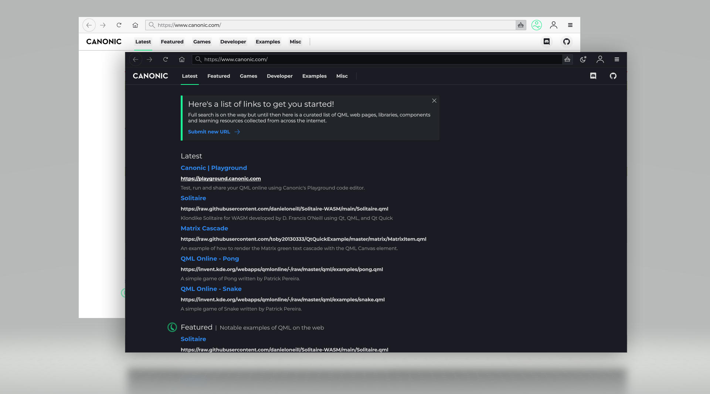

  

<h1 align="center">
  Canonic
</h1>

<h3 align="center">
    Opensource QML browser
</h3>

   Explore a slice of the web that no other web browser supports. 

    
      
    

<h3 align="center">
  <a href="https://www.canonic.com">Try</a>
   · 
  <a href="https://docs.page/canonic/canonic">Docs</a>
   · 
  <a href="https://github.com/canonic/canonic/issues">Report a bug</a>
</h3>

[Canonic](https://www.canonic.com/) is an experimental QML web browser developed in the [Qt framework](https://www.qt.io/) and licensed under GPL3. 

A live [WebAssembly](https://webassembly.org/) version of the browser is available to try at https://www.canonic.com/. 

## Worlds first browser within a browser

A live WebAssembly version of the browser is available to try at https://www.canonic.com/.

## Security
Canonic maintains two `QQuickRenderControl` instances that each manage their own `QQmlEngine` instances and contexts. Both instances render to hidden virtual windows that are then composited together using GLSL. Using this structure Canonic is able to split the main browser UI from the QML content loaded from the web to a degree. 

That said there is still a lot of work required to make Canonic fully secure when running natively. Canonic is currently missing most of the sandboxing features offered by modern web browsers (CORS, separate processes, file system protection, permissions, etc) as well as additional logic to handle QMLs access to C++ land. This is part of the reason why Canonic is currently only available via WebAssembly as WASM provides a safe sandbox in which QML browser technology can be explored.

## Contributing
Join the [Discord server](https://discord.com/invite/YcsEwdaNbR) if your interested in contributing or just finding out more.
